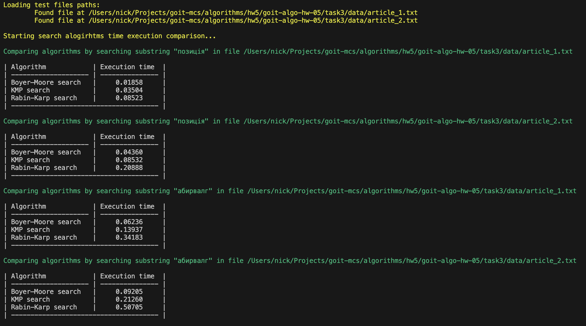

# Algorithms - Homework 5

Було порівняно 3 алгоритми текстового пошуку:

- Боєра-Мура (Boyer–Moore search)
- Кнута-Морріса-Пратта (KMP search)
- Рабіна-Карпа (Rabin-Karp search)

У якості вхідних даних було використано 2 текстових файли:

- `task3/data/article_1.txt`
- `task3/data/article_2.txt`

У якості пошукових даних було використано наступні підрядки:

- `позиція` з індексами `3044` і `7526` у першому і другому файлах, відповідно
- `абирвалг` - відстуній в обох файлах

За допомогою модулю `timeit` було виконано вимірювання середнього часу пошуку у
секундах для кожного з алгоритмів на основі 100 замірів.

Результати наведені на зображенні нижче:

## Висновок

Отже, в результаті усіх тестових замірів алгоритми розмістилися в такому порядку
по швидкості виконання (від найшвидшого до найповільнішого):

- Алгоритм Боєра-Мура
- Алгоритм Кнута-Морріса-Пратта
- Алгоритм Рабіна-Карпа
